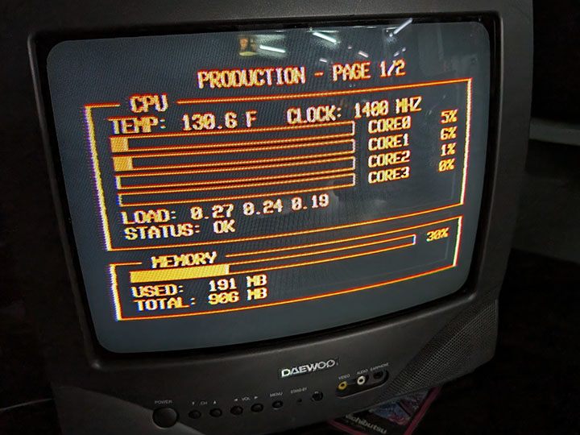
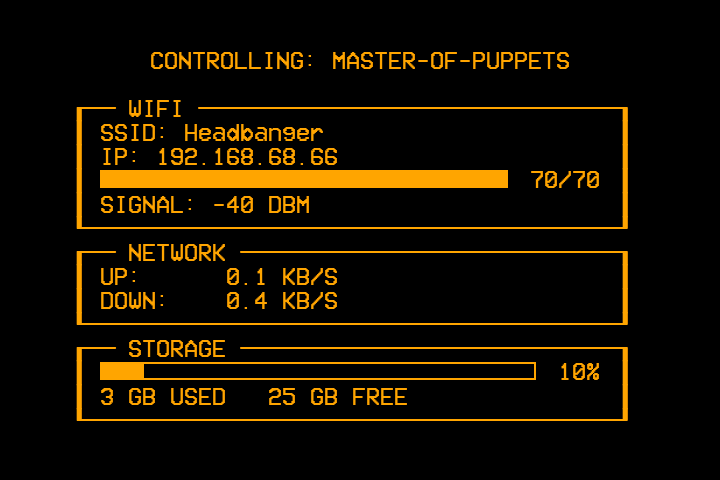
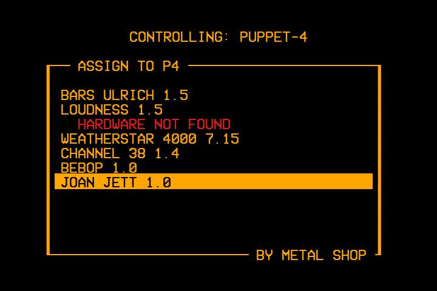

# CENTRAL SCRUTINIZER (`scrutinizer`)

The control-and-monitoring hub for a [McBrain](https://github.com/LawtonBarnes/mcbrain)
Raspberry Pi fleet -- an MS-DOS/OpenVMS monitor-style amber-phosphor
dashboard for the local machine, plus live remote monitoring, app
assignment, and input relay for every other machine in the fleet, all
from one physical remote control.

Built for a Raspberry Pi 3B+ running Raspberry Pi OS Bookworm, output via
the analog composite video jack to a CRT. Shares its console/framebuffer
architecture with [BARS](https://github.com/LawtonBarnes/bars) -- headless
pygame, direct `/dev/fb0` writes, raw `evdev` keyboard input.







**Runs on exactly one machine in a fleet** -- the one with a USB remote
attached. Every other fleet machine ("puppet") runs
[STRINGS](https://github.com/LawtonBarnes/strings) instead, which
SCRUTE talks to over HTTP. Standalone (no fleet) use is also fine --
SCRUTE just shows `LOCAL` stats and a local app menu with nothing to
monitor remotely.

## Three pages, one process

Pages are cycled with `←`/`→`; what `↑`/`↓` does depends on which page
you're on:

| Page | Content | `↑`/`↓` |
|---|---|---|
| 1 | CPU temp/clock/load/per-core, memory | Switch monitored machine: `LOCAL` → each puppet → `PRODUCTION` → back to `LOCAL` |
| 2 | WiFi signal/SSID, network throughput, disk usage | Same as page 1 |
| 3 | App menu -- cursor-navigable list of installed apps for whichever machine is currently selected | Move the menu cursor |

| Key | Action |
|---|---|
| `←` / `→` | Change page |
| `↑` / `↓` | Context-sensitive -- see table above |
| Menu / hamburger | Jump straight to the app menu (page 3) for whichever machine is currently selected |
| `Enter` | On the app menu: launch (if `LOCAL`) or remotely assign (if a puppet/`PRODUCTION`) the highlighted app |
| `Home` / `Back` | Jump straight to page 1 |
| `Q` / `Esc` | Quit to shell |
| `Power` | Confirm dialog: shutdown/restart **the whole fleet at once**, not just this machine |

Selecting a machine other than `LOCAL` doesn't just change what's
displayed -- it also retargets what Enter does on the app menu (assigns
that remote machine instead of launching locally) and, in **control
mode** (see below), where keypresses get relayed.

## Remote monitoring + control

- **Live stats**: a background poller hits every puppet's STRINGS
  `/status` on its own thread (never blocking the main render loop, even
  if a puppet is unreachable) and feeds the same CPU/memory/WiFi/disk
  panels used for `LOCAL`. An offline puppet shows a plain
  `{TARGET} OFFLINE / UNREACHABLE` message instead of stale or blank
  panels.
- **Remote app assignment**: selecting an app on the menu page while a
  puppet is targeted `POST`s to that puppet's STRINGS `/assign` instead
  of launching a subprocess locally. The menu's hardware-readiness
  column is target-aware too -- it shows *that puppet's own*
  STRINGS-reported readiness, not the local machine's.
- **IDENTIFY PUPPETS**: a menu row (not a real installed app) that
  broadcasts an identify command to every puppet at once, forcing each
  one's currently-running app to show a hostname overlay -- useful for
  matching a physical CRT to its Pi during cabling.
- **Control mode**: relay live keypresses to whichever remote machine is
  targeted, so the physical remote can drive a puppet's running app
  directly (e.g. skip tracks on a remote `bebop`) without walking over
  to it.
- **Fleet-wide Power**: the Power dialog's Shutdown/Restart applies to
  every machine in the fleet in one action, not just the local one.

## Sibling apps launched/assigned from the menu

Each is its own repo -- paths and launcher commands come from the
`APPS` table at the top of `scrutinizer.py`:

- [BARS](https://github.com/LawtonBarnes/bars) -- NTSC/SMPTE test patterns
- [LOUDNESS](https://github.com/LawtonBarnes/loudness) -- audio spectrum visualizer
- WEATHERSTAR 4000 -- current conditions (not a separate repo, built on [ws4kp](https://github.com/netbymatt/ws4kp))
- [CHANNEL 38](https://github.com/LawtonBarnes/channel38) -- Ole Miss sports/news ticker
- [bebop](https://github.com/LawtonBarnes/bebop) -- iPod-style MP3 player
- [JOAN JET](https://github.com/LawtonBarnes/joanjett) -- ADS-B flight radar (needs an RTL-SDR dongle)

## Boot behavior

`~/.bashrc` launches `scrutinizer` directly on physical tty1 login
(console autologin is configured separately via systemd) -- this is what
makes the hub machine boot straight into the live dashboard with no
manual steps, even before a remote is plugged in (input handling
degrades gracefully to non-interactive if no keyboard/remote is found
at startup, and picks it up live once one is attached).

## Fleet configuration

`PUPPETS` (a hardcoded list of `(name, ip)` tuples near the top of
`scrutinizer.py`) is the single source of truth for every puppet's
address -- everything remote (stats polling, app assignment, control-mode
relay, the fleet-wide Power button) goes through this list. **If a
puppet's IP ever changes, this file needs a manual edit and a SCRUTE
restart** -- it's not derived from DNS/mDNS/anything live, so a stale
entry silently drops that one puppet from every fleet feature rather
than erroring loudly. `sync-fleet.sh` (also in this repo) has a matching
`PUPPET_IPS` table that needs updating at the same time.

## Install

```bash
sudo git clone https://github.com/LawtonBarnes/scrutinizer.git /opt/scrutinizer
sudo apt-get install -y python3-pygame python3-evdev python3-numpy python3-psutil
sudo raspi-config nonint do_boot_behaviour B2   # console, autologin
```

Then add to `~/.bashrc` (guarded to the physical console, so SSH
sessions aren't affected):

```sh
if [ "$(tty)" = "/dev/tty1" ]; then
    python3 /opt/scrutinizer/scrutinizer.py
fi
```

Edit `PUPPETS` near the top of `scrutinizer.py` with your actual fleet's
hostnames/IPs before first boot (or leave it empty for standalone,
no-fleet use).
